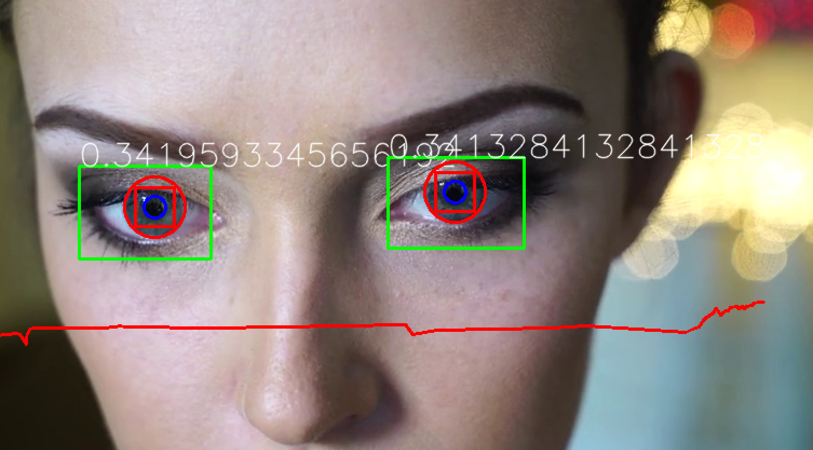

# Eye

Measure eye dilation from webcam or video



Dependencies:
```sh
# Recommended: setup python virtual environment
python -m venv venv
source venv/bin/activate
# Install opencv
pip install opencv-python
# Install data analysis packages (needed by ./process_data.py but not by ./main.py)
pip install pandas
pip install scipy
pip install matplotlib
```

Installation:
``` sh
mkdir build && cd build
cmake ..
make
```

Run:
``` sh
./main.py
```

Check out `./main.py --help` for possible arguments
Press ESC to quit.

Plot results:

```
python -i process_data.py slog.csv -s 51
```
Again, check out `./process_data.py --help` (and code therein) for possible arguments.

Example output:


Here blue line is the original data (filtered using a smoothing kernel),
and orange is the data that is filtered and then denoised.

The experiment here was to close one eye and measure pupil dilation on another
eye. This was done periodically several times. As can be seen from the plot,
the pupil dilated when one eye was closed.

This observation can also be checked manually by looking at the video recording.
In other words, the system does indeed capture some information about pupil dilation,
and not things that can be attributed to other factors.

For example, a worse experiment would be to toggle the light and try to measure the pupil
dilation. It's worse because the system might then just detect the fact that overall
scene illumination level changed as opposed to pupil changing size.


License: MIT
